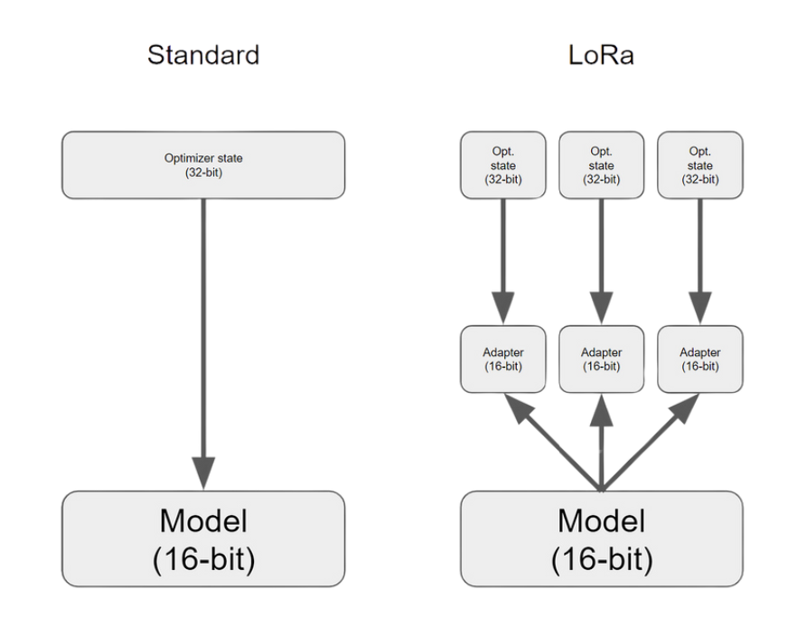
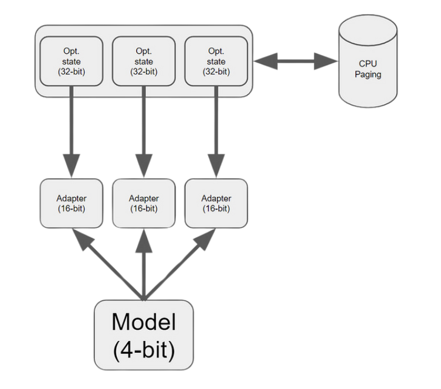
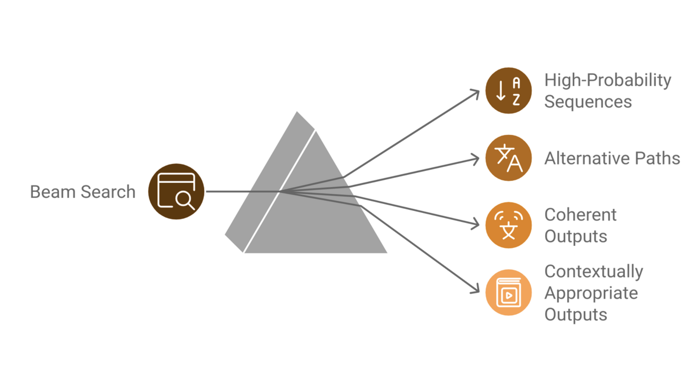
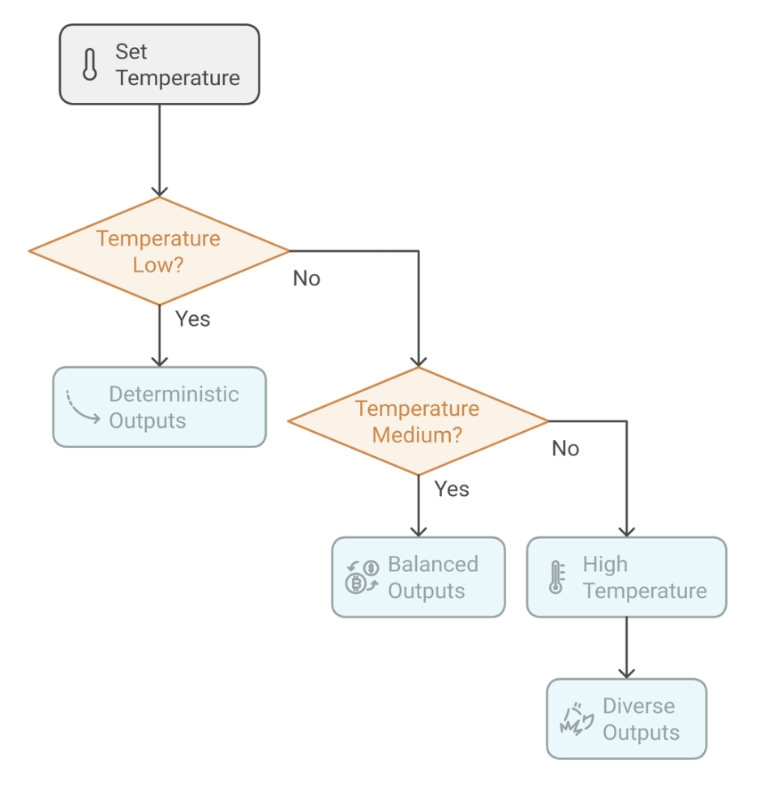
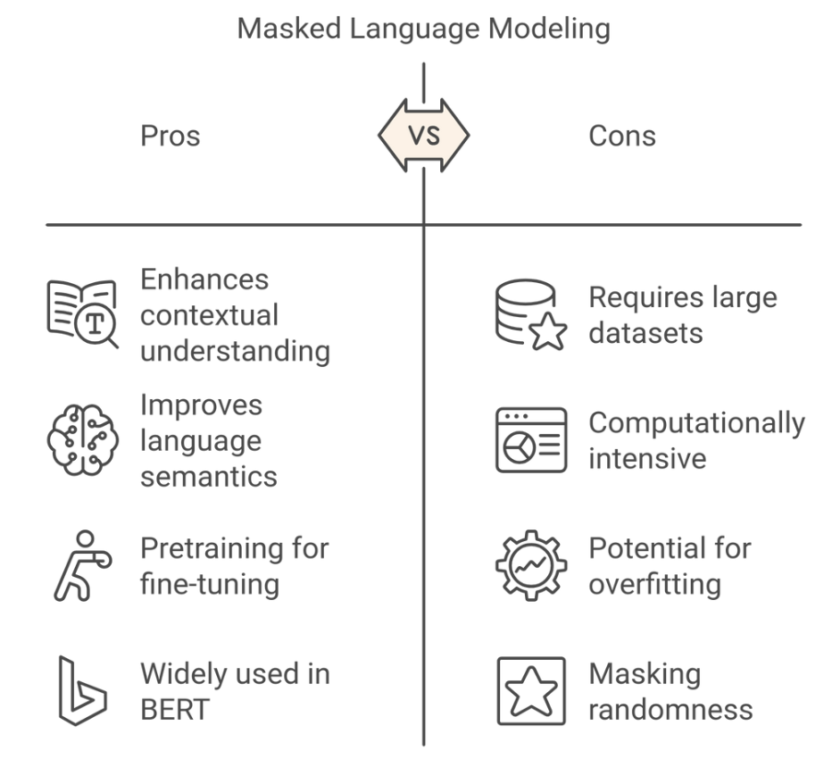

# LLM-Guideline

## What is tokenization, and why is it important in LLMs?
Tokenization is the process of splitting text into smaller units called tokens, which can be words, subwords, or even characters. For instance, the word "tokenization" might be broken down into smaller subwords like "token" and "ization". This step is crucial because LLMs do not understand raw text directly. Instead, they process sequences of numbers that represents these tokens. \
Effective tokenization allows models to handle various languages, manage rare words, and reduce the vocabulary size, which improves both efficiency and performance.

## What is LoRA and QLoRA?
LoRA and QLoRA are techniques designed to optimize the fine-tuning of Large Language Models (LLMs), focusing on reducing memory usage and enhancing efficiency without compromising performance in Natural Language Processing (NLP) tasks.

### LoRA (Low-Rank Adaptation)
LoRA is a parameter-efficient fine-tuning method that introduces new trainable parameters to modify a model's behavior without increasing its overall size.
By doing so, LoRA maintains the original parameter count, reducing the memory overhead typically associated with training large models.
It works by adding low-rank matrix adaptations to the model's existing layers, allowing for significant performance improvements while keeping resource consumption in check.
This makes it ideal for environments where computational resources are limited, yet high model accuracy is still required.

### QLoRA (Quantized LoRA)
QLoRA builds on LoRA incorporating quantization to further optimize memory usage. It uses techniques such as 4-bit Normal Float, Double Quantization, and Paged Optimizers to compress the model's parameters and improve computational efficiency.
By reducing the precision of model weights (e.g. from 16-bit to 4-bit) while retaining most of the model's accuracy, QLoRA allows for the fine-tuning of LLMs with minimal memory footprint.
This method is particularly useful when scaling large models, as it maintains performance levels comparable to full-precision models while significantly reducing resource consumption.

## What is beam search, and how does it differ from greedy decoding?
Beam search is a search algorithm used during text generation to find the most likely sequence of words.
Instead of choosing the signle highest-probability word at each step (as greedy decoding does), beam search explores multiple possible sequences in parallel, maintaining a set of the top k candidates (beams). It balances between finding high-probability sequences and exploring alternative paths. This leads to more coherent and contextually appropriate outputs, especially in long-form text generation tasks.

## Explain the concept of temperature in LLM text generation?
Temperature is a hyperparameter that controls the randomness of text generation by adjusting the probability distribution over possible next tokens.
A low temperature (close to 0) makes the model highly deterministic, favoring the most probable tokens.
Conversely, a high temperature (above 1) encourages more diversity by flattening the distribution, allowing less probable tokens to be selected.
For instance, a temperature of 0.7 strikes a balance between creativity and coherence, making it suitable for generating diverse but sensible outputs.

## What is masked language modeling, and how does it contribute to model pretraining?
Masked language modeling (MLM) is a training objective where some tokens in the input are randomly masked, and the model is tasked with predicting them based on context.
This forces the model to learn contextual relationships between words, enhancing its ability to understand language semantics.
MLM is commonly used in model like BERT, which are pretrained using this objective to develop a deep understanding of language before fine-tuning on specific tasks.

